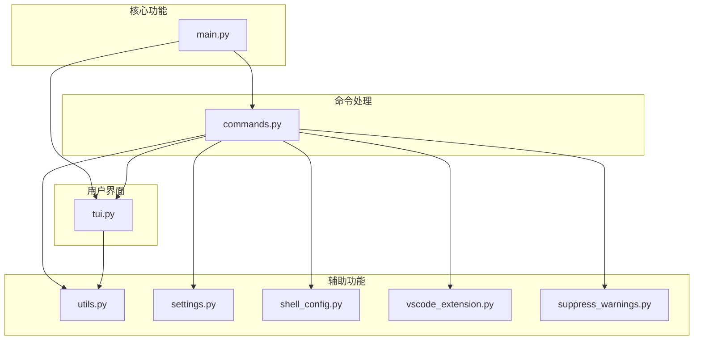
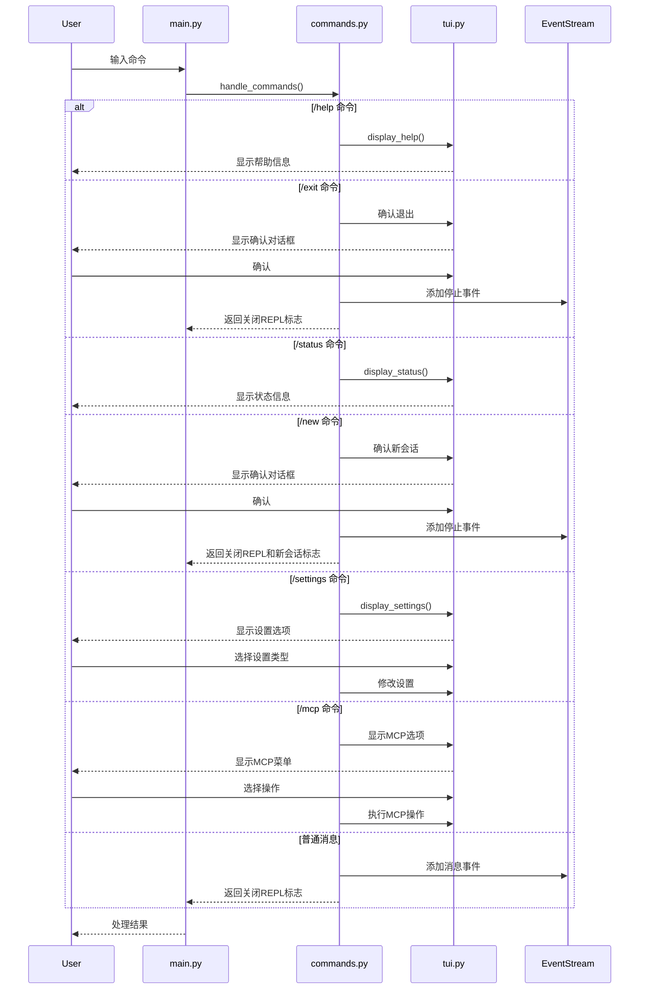
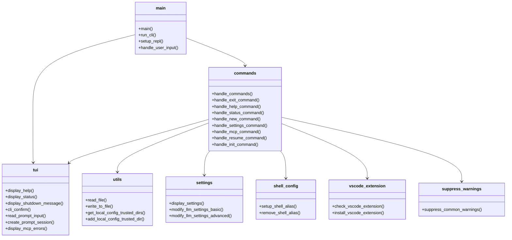
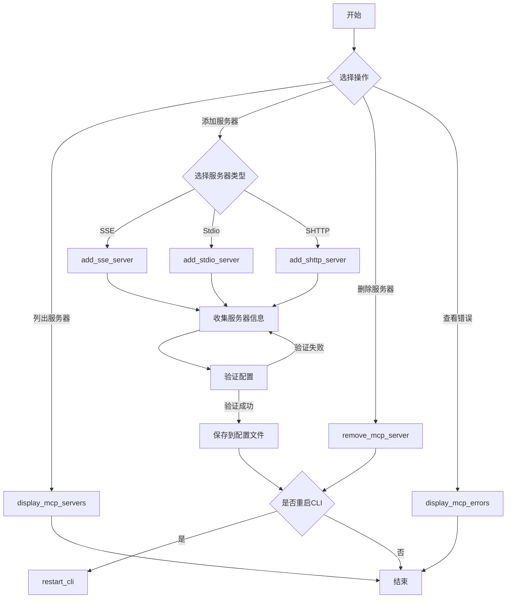

# OpenHands CLI 模块结构图表

## 模块组件关系图

## 命令处理流程

## 文件功能概述

## MCP服务器管理流程

## CLI命令概述

| 命令 | 描述 | 处理函数 |
|------|------|----------|
| `/help` | 显示帮助信息 | `handle_help_command()` |
| `/exit` | 退出当前会话 | `handle_exit_command()` |
| `/status` | 显示当前状态 | `handle_status_command()` |
| `/new` | 开始新会话 | `handle_new_command()` |
| `/settings` | 修改设置 | `handle_settings_command()` |
| `/mcp` | 管理MCP服务器 | `handle_mcp_command()` |
| `/resume` | 恢复当前任务 | `handle_resume_command()` |
| `/init` | 初始化仓库 | `handle_init_command()` |
